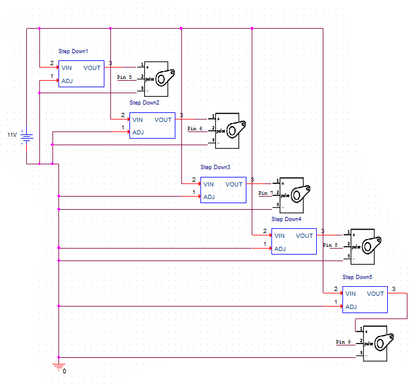

# Purpose
Leap Motion Interfacing with Arduino & Processing to control 3-D printed Robotic Fingers through Servos motors
# Demo  
[placeholder]  
# Materials  
  * Leap Motion  
  * Step-Down Regulators (12V - 5V)  
  * Arduino Uno R3
  * Additional Software - Processing  
# Schematic  
  
Pin 2 on each Motor is connected to its respective Arduino PWM pin.  
We include step down regulators to fit the Servos Motor specifications avoid burning them out.
# Download (Processing Library)  
Download from here [https://github.com/mrzl/LeapMotionP5/archive/master.zip](https://github.com/mrzl/LeapMotionP5/archive/master.zip) extract the folder in the archive into your processing libraries folder and rename it from LeapMotionP5-master to LeapMotionP5. After that restart Processing and the library should be included. Check the examples within the library.
